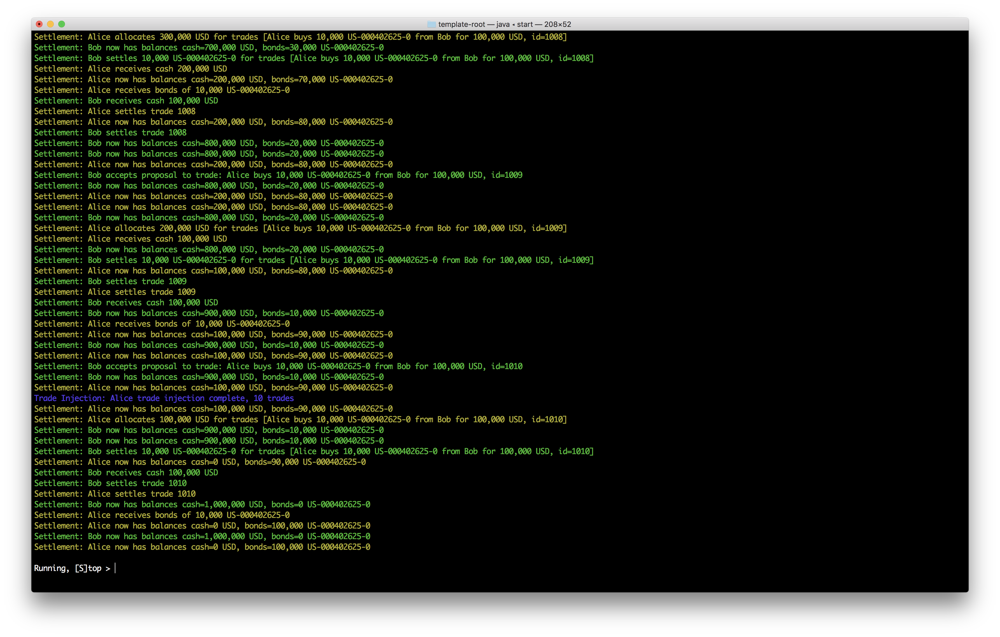

Bond trading
############
.. image:: https://circleci.com/gh/digital-asset/ex-bond-trading.svg?style=svg
    :target: https://circleci.com/gh/digital-asset/ex-bond-trading

This is an example of trading bonds against cash. It covers how this process can be modeled in DAML, and how it can be automated with the Java Application Framework.

In the documentation for this example

`Bond trading model`_
  This page describes the complexity of exchanging bonds against cash.
`DAML implementation`_
  This page explains how to model and implement the processes in DAML.
`Automation overview`_ and `Automation implementation`_
  These pages show how parts of the process can be automated.

Building the system
*******************

All needed binaries can be built with the provided pom.xml_ and Makefile_:

- ``cd`` to the root directory.
- Type ``make``.

Note that this requires Maven and the DAML SDK to be installed.

Running the system
******************

Once the application JAR is built, the provided start script will run all needed automation processes.

To run the application:

- Type ``make start-daml``. Once the sandbox and navigator are started,
- Type ``make start-app`` in another shell.

This runs the sandbox, navigator, and automation_. You may navigate to http://localhost:4000/sign-in/ to explore the ledger or this may open for you automatically if the DAML SDK is installed locally.

The script injects trades, and sends progress output to the terminal. It also puts a prompt at the screen bottom which lets you stop the system.

After running, your screen should look like this:

.. _pom.xml: code/pom.xml
.. _Bond trading model: docs/01-bond-trading-model.rst
.. _DAML implementation: docs/02-daml-implementation.rst
.. _Automation overview: docs/03-automation-introduction.rst
.. _Automation implementation: docs/04-automation-implementation.rst
.. _automation: docs/04-automation-implementation.rst
.. _Makefile: code/Makefile
.. _docker: https://www.docker.com/get-started

License
*******
::

  Copyright (c) 2019, Digital Asset (Switzerland) GmbH and/or its affiliates. All rights reserved.
  SPDX-License-Identifier: Apache-2.0
