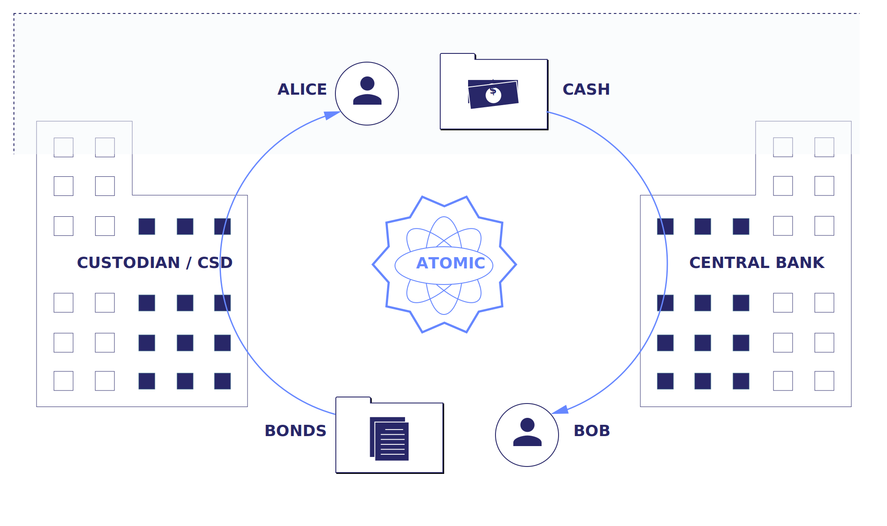

Bond trading model
##################

*Previous:* `README </README.rst>`_.

Note: This example focuses on the trading of bonds, but the mechanisms explained are applicable to many other securities.

What is bond trading?
*********************

Trading bonds involves the exchange of bonds against a cash payment on an agreed-to settlement time. This workflow is also known as a Delivery versus Payment (DvP).

Trading a bond implies that two parties - the seller and buyer - enter a DvP contract. In this contract, the buyer agrees to purchase a certain quantity of bonds from the seller at the settlement time, in exchange for a fixed amount of cash.

Why bond trading is complex
***************************

DvP transactions should be atomic:  the two transfers should either happen simultaneously or not at all. There is a "Principal Risk" that either the seller receives payment, but does not deliver the security, or vice versa.

This Principal Risk is a primary concern in the securities industry. The failure of one of the legs of the exchange to be executed can lead to knock-on effects that can reverberate through the entire financial system.

Bond trading parties
********************

In part to mitigate this risk, the process of trading bonds in modern markets is surprisingly complex, and involves many parties in various roles. To name just a few: 

- Each trading party may have an executing broker and a bank or custodian for cash and securities.
- These, in turn keep cash and securities at a Central Bank (CB) and Central Securities Depository (CSD), respectively.
- To arrange and execute the deal, the parties may go though a securities exchange and use a clearinghouse to act as a central counterparty and reduce principal risk.

.. _da-docs-example-bond-trading-model:

How this example models bond trading
************************************

This example boils down the involved roles to the minimum:

- Alice (the buyer) has some cash and wants to buy some bonds
- Bob (the seller) has some bonds that he wants to sell
- a CSD holds the securities accounts
- a CB holds the cash accounts

A DvP between Alice and Bob requires the atomic movement of bonds from the seller to the buyer at the CSD, and cash from the buyer to the seller at the CB:

*Next:* `DAML implementation <02-daml-implementation.rst>`_.
