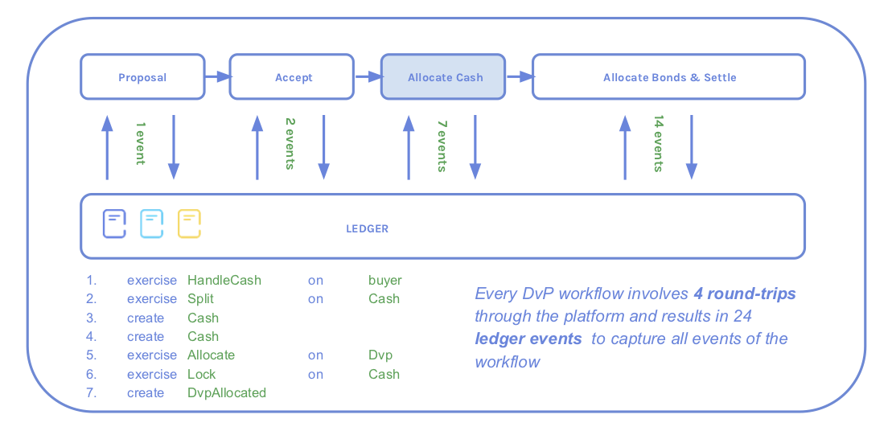

DAML implementation
###################

*Previous:* `Bond trading model <01-bond-trading-model.rst>`_

This page highlights three different aspects of the example:

1. The contract templates that form the `Core Model`_.
2. `Settlement contracts`_, which ease the execution of transactions and integration with the automation.
3. `Factors affecting performance`_ in the design choices of the DAML model.

Core model
**********

.. _quickstart: https://docs.daml.com/getting-started/quickstart.html

Note: This example models assets and DvPs in a very similar way to the quickstart_ example. This example won't go through them in detail; for more information, see that tutorial.

Bond template
=============

A bond asset is represented by a `Bond <../src/main/daml/Bond.daml#L9-L38>`_ template, and is identified by an ``isin`` with two obligable parties, an ``issuer`` and ``owner``.

Similar to ``IOU`` in quickstart_, bonds have ``Split``, ``Transfer``, ``Merge``, and ``Archive`` choices.

`See the relevant lines in the Bond template <../src/main/daml/Bond.daml#L9-L38>`_.

BondTransferRequest template
============================

Because of the rules that DAML enforces, it is not possible for a party to issue this kind of multi-party agreement to another party directly. Such a creation would force the other party into the agreement without their consent.

Instead, the ``issuer`` issues bonds by creating a `BondTransferRequest <../src/main/daml/Bond.daml#L42-L66>`_ to the future owner as ``recipient``, taking both the role ``issuer`` and ``sender``

This “offer-acceptance” pattern for instantiating contracts is very common in DAML. It has two steps:

1. An originating party (for example, a CSD) creates a contract that has a choice controlled by the receiving party, say Bob.
2. When the ``newOwner`` Bob exercises this choice, a new contract is created on the ledger and the offer contract is archived.

The new contract identifies both the CSD and Bob as signatories and spells out their rights and obligations. Both have authorized the contract: the CSD when it created the offer contract, and Bob when he exercised the choice on that offer.

`See the relevant lines in the BondTransferRequest template <../src/main/daml/Bond.daml#L42-L66>`_.

Cash template
=============

`Cash <../src/main/daml/Cash.daml>`_ follows a similar pattern. The only noteworthy difference is that cash can be `locked <../src/main/daml/Cash.daml#L55-L60>`_, which makes sure that it cannot be spent after it is allocated to a DvP.

`See the full Cash template <../src/main/daml/Cash.daml>`_.

DvP template
============

Bonds are traded through the DvP workflow where the ``buyer`` and ``seller`` enter a `DvP <../src/main/daml/Dvp.daml>`_ contract that settles bonds against cash at the ``settleTime``.

Here is a summary:

1. The buyer proposes a DvP using a `DvpProposal <../src/main/daml/Dvp.daml#L17-L26>`_ contract that the seller can accept. When they accept, this creates a `DvP <../src/main/daml/Dvp.daml#L40-L58>`_ contract.

   (This is the same "offer-acceptance" pattern as for bonds.)
2. The ``buyer`` `allocates <../src/main/daml/Dvp.daml#L48-L58>`_ cash which gets locked. This results in a `DvpAllocated <../src/main/daml/Dvp.daml#L62-L95>`_ contract.

   Keep in mind that the cash has not yet transferred from the ``buyer`` to the ``seller``: the ``buyer`` is still the owner. Otherwise the workflow would impose principal risk.
3. The ``seller`` `settles <../src/main/daml/Dvp.daml#L72-L95>`_ the ``DvpAllocated`` contract by providing bonds resulting in the actual transfer of bonds vs cash. This completes the transaction

Of note here is how the different states of a Dvp flow are represented by different template types. This is in contrast to an more conventional approach of mutating a single template type to represent the current state. Since DAML templates are immutable, mutating the state always requires creation of a new instance - so using different template types does not cost anything extra. This has some advantages:

1. The states are easily identified by the template type. We do not have to examine each template's values to find the state. This makes the code clearer, and applications easier to write.

2. If the mutable approach was taken, the template variables that changed would probably have values missing in certain states. This would require the use of the ``Optional` type to represent the possibly missing value. By using different types, we can simply add the new variable when the state requires it, eliminating the ``Optional``, and making the implementation simpler.

`See the DvpProposal <../src/main/daml/Cash.daml>`_ and `DvP <../src/main/daml/Dvp.daml#L40-L58>`_ templates.

Atomic transfer
===============

Aside from checking that the correct amounts of cash and bonds were provided to the DvP, it only takes `four lines of code <../src/main/daml/Dvp.daml#L90-L93>`_ to make sure that either both cash and bonds are transferred simultaneously or not at all.

Settlement contracts
********************

In the DvP workflow, cash and bonds are allocated to the DvP, and settlement is performed by exercising a choice on that DvP. If one of the parties does not hold the exact amount in a single ``Bond`` or ``Cash`` contract, they first have to split or merge assets. This would have to be done in a separate API call, which has some downsides:

- The application layer has to keep track of the state of the workflow between the asset preparation and the allocation.
- Making two API calls has a bigger performance impact. For more on this, see `Factors affecting performance`_ below.

Instead, this example deals with these side processes using helper contracts that combine steps of a workflow. That way, the entire operation of splitting and allocating can be performed in a single API call.

SettlementProcessor template
============================

`Settlement.daml <../src/main/daml/Settlement.daml>`_ includes a helper contract ``SettlementProcessor``. This helper contract facilitates merging and splitting of bonds and cash, and the allocation of the correct amounts to a provided list of DvPs.

`See the full Settlement template <../src/main/daml/Settlement.daml>`_.

Non-consuming choices
=====================

Both choices, `AllocateCash <../src/main/daml/Settlement.daml#L35-L52>`_ and `SettleMany <../src/main/daml/Settlement.daml#L54-L73>`_, are non-consuming because ``SettlementProcessor`` contracts should not be archived after a choice is exercised.

This is very common: helper contracts are created once and then kept to facilitate a certain workflow.

Factors affecting performance
*****************************

For latency-sensitive applications, DAML contracts should be designed with performance in mind. This section explores the most important factors that affect performance.

Note: The key message is:

  - Keep in mind the number of workflow steps when modelling a complex workflow.
  - Reducing the number of round trips can improve performance.

Amount of data on contracts
===========================

The amount of data stored on contracts impacts latency. Writing more data to the ledger simply takes longer.

Therefore, to optimize for performance, only information essential to a workflow should be stored on the contracts that are involved in it.

For example, a bond may only be fully characterized by a couple dozen fields, but the bond in this example is keyed by an ``isin``, which is enough to model the DvP flow. If the model is extended and additional bond data is required, a reference data contract keyed by the same ``isin`` could be introduced.

Number of workflow steps
========================

The number of workflow steps has a direct impact on latency.

This diagram shows the number of round trips and ledger events for the DvP workflow:

Without the helper contract, the events involved in splitting and allocation would be the same, but be split into two steps each, meaning there are two additional round trips to the ledger.

In this example, there are few other bottle-necks, so the round trips are the primary drivers of latency - the difference between four and six steps is significant.

Number and nature of events
===========================

The number and nature of events generated also plays a part. The result of each transaction needs to be reduced to those parts visible to each involved party and communicated across the network accordingly. Transactions with large outputs, or many different stakeholders are expensive to distribute.

*Next page:* `Automation introduction <03-automation-introduction.rst>`_.
