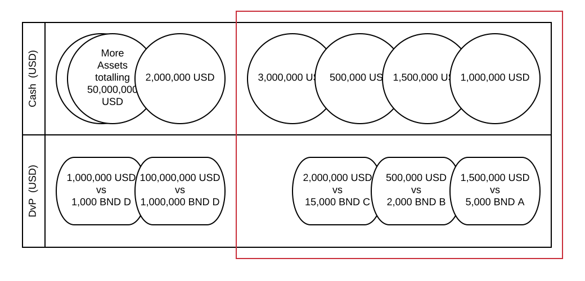
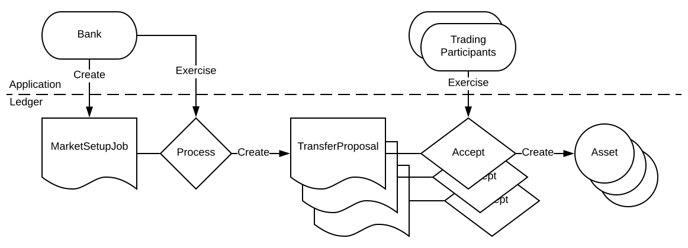

Automation overview
###################

*Previous:* `DAML implementation <02-daml-implementation.rst>`_.

This example has three different types of automation:

`Trading party automation`_
  Each trading party runs an application which keeps the current ledger state in memory. These applications perform certain actions without requiring user input:
  
  - accept transfer proposals
  - accept trade proposals
  - allocate and settle Trades

  *This kind of automation layer is usual in DAML applications.*
  
`Automated market setup`_
  During startup, the parties create special contracts and execute choices that load the ledger with data. These put the ledger into a sensible initial state.

  *This kind of automation is useful when pre-agreed external data needs to be loaded onto the ledger.*
  
`Automated user simulation`_
  Over time, the automation performs a pre-specified list of user actions to show the trading party automation in action.

  *This kind of automation is useful for demos and testing.*

Trading party automation
************************

In this example, the trading parties have automated almost all choices, and they are performed without any checks. Specifically, the trading parties:

- accept all transfer proposals
- accept all trade proposals
- allocate and settle all trades, whenever possible

The only major user action that is not automated is creating transfer and trade proposals.

Bear in mind that this is not realistic: nobody would accept a trade proposal without checking the terms. But having such checks would not add anything to this example, so they are left out.

Acceptance of proposals is implemented reactively, whereas allocation and settlement are state-based :

- For any ``create`` event of a ``CashTransferRequest``, ``BondTransferRequest``, or ``DvPProposal``, the application sends a corresponding ``Accept`` command to the ledger.
- For allocation and settlement, trades need to be matched with assets in order to allocate them appropriately.

To do this, the application needs access to a queryable view of active contracts on the ledger, called an *Active Contract Store (ACS)*.

For the application to be able to match cash and bonds with trades, the ACS needs to contain at least:

- All ``Cash`` contracts the trading party holds, including amounts and currencies.
- All ``Bond`` contracts the trading party holds, including quantities and ISIN.
- All ``DvP`` contracts on which the trading party is the buyer, including cash amounts and currencies.
- All ``DvPAllocated`` contracts on which the trading party is the seller, including bond ISIN and amount.

To keep the ACS in sync with the ledger:

- When a create event for one of these contract types is received, the contract is added to the ACS.
- When an archive event is received, the contract is removed.

Every time the ledger changes (meaning a transaction is confirmed):

- As many DvPs as possible for each currency and ISIN are allocated or settled, consuming both assets and trades in first-in-first-out order.
- Assets are split and merged to match the trades as described in `Settlement contracts <daml-implementation.rst#settlement-contracts>`_.
- Any change is returned back into the respective collection of assets by the processing of its ``create`` event.

  Figure 1

  The above illustrates part of the ACS. ``Cash`` and ``DvP`` contracts in USD are shown in the order in which their ``create`` events were processed. The red box shows which trades are allocated using which assets. Note that there are better allocation strategies available. There are ``Cash`` contracts matching the ``DvP`` values exactly, and the fifth ``DvP`` could be allocated using the available assets. Improving this allocation logic is straightforward and left to the reader.

Avoiding double spending
========================

Between an allocation or settlement command being submitted and the resulting transaction being confirmed, it is possible that other transactions will be confirmed. Since confirmed transactions trigger the allocation and settlement logic, this could cause attempted double-spending, which would result in failed transactions.

To prevent this, any assets and trades involved are removed from the ACS at the time the command is sent off.

If the command fails, this can cause a problem: the assets and trades are not consumed and the ACS gets out of sync with the ledger. Recovering from this state is not included in this example for the sake of simplicity. It would be handled by subscribing to the command completion service and adding the contracts used in failed commands back into the ACS.

Automated market setup
**********************

This example has three parties: a Bank, and trading parties Alice and Bob. In the market setup automation:

- The Bank needs to issue pre-specified `Bond` and `Cash` contracts to Alice and Bob.

  `Cash` and `Bond` contracts are signed by both `issuer` and `owner` so the Bank cannot issue them directly to the trading participants. However, it can create transfer proposals from the Bank for assets issued by the Bank, since then both signatories on the proposal are the Bank itself.

  The `Trading party automation`_ accepts all transfer proposals, so creating such transfer proposals is enough to supply Alice and Bob with the desired assets.
  
- Alice and Bob need to set up their ``SettlementProcessor`` contracts.

  ``SettlementProcessor`` only has one signatory, so it can be created with a create command by each of the trading participants on startup.

To avoid generating a lot of create commands for the individual assets, all issuances are bundled into a special ``MarketSetupJob`` contract. This contract uses a ``Process`` choice to create the ``TransferProposal`` contracts on-ledger.

  Process for issuing assets to market participants

Automated user simulation
*************************

To simulate Alice and Bob trading, the automation reads in pre-specified DvP terms and creates ``DvPProposal`` contracts accordingly, with a specified delay between proposals.

This part of the automation begins when a ``SettlementProcessor`` contract is created, because this indicates that the market participant is up and running. 

It slowly creates all specified trade proposals once, and then quits.

*Next:* `Automation implementation <04-automation-implementation.rst>`_.
