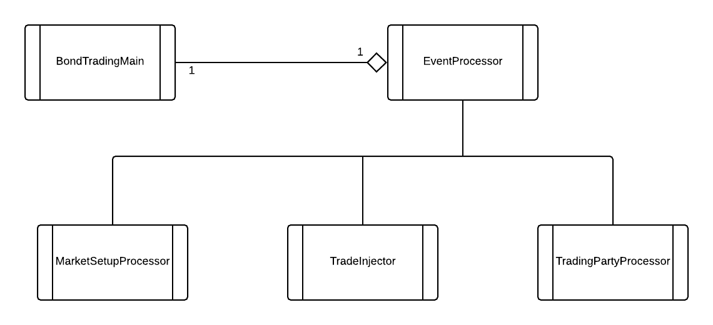

Automation implementation
#########################

*Previous:* `Automation overview <03-automation-introduction.rst>`_.

The automation is built using Java bindings to the low-level gRPC server API. This API is event-driven: it delivers notifications of contract creation, exercises, and archives as an event stream. It is implemented using RxJava reactive streams.

Each of the automation functions (`Trading party automation <automation-introduction.rst#trading-party-automation>`_, `Automated market setup <automation-introduction.rst#automated-market-setup>`_, and `Automated user simulation <automation-introduction.rst#automated-user-simulation>`_) is implemented as a Java class, all derived from the common base class ``EventProcessor``.

A top-level class, ``BondTradingMain``, acts as the main class for any of these. It accepts command line arguments, which determine what part of the automation to execute, and on behalf of which party.

A full application consists of multiple processes - one for each party and automation function. Each of these processes can be considered a *bot* that performs autonomous actions on behalf of the party.

BondTradingMain
***************

BondTradingMain.java_ implements a `main() <../src/main/java/com/digitalasset/examples/bondTrading/BondTradingMain.java#L171-L181>`_ method that:

#. Creates an instance of itself and calls its ``run()`` method.
#. Waits in a sleep loop for a termination indication from other threads.
#. Terminates itself with a provided exit code.

The `run() <../src/main/java/com/digitalasset/examples/bondTrading/BondTradingMain.java#L234-L290>`_ method implements the bulk of the required set-up. It:

#. Connects to the ledger, creating an instance of a gRPC ``ManagedChannel``.
#. Fetches the ``ledgerId`` and the primary ``packageId``.
#. Creates a processor object (one of `MarketSetupProcessor`_, `TradeInjector`_ or `TradingPartyProcessor`_), passing in the channel, ledgerId, packageId, and specified party to the constructor.

The initial command-line argument determines the class of the processor, and through that the function of the created bot.

Each of the processor classes performs a separate function, but have a lot of behavior in common. This is captured by using a common superclass, ``EventProcessor``.

EventProcessor
**************

EventProcessor.java_ is an abstract class, responsible for:

* creating a command submission service
* creating services that provide transaction and command completion events
* connecting these to RxJava streams
* tracking in-flight (pending) commands, and handling their completion
* unpacking transactions into events and dispatching them for processing

The service classes for the transaction, completion and submission services are set up in a similar manner, on processor construction. Each service is represented by a gRPC service class, which provides a factory method that takes the channel as an argument.

These service instances are stored in instance variables in the processor.

Once these services are established, the `run() <../src/main/java/com/digitalasset/examples/bondTrading/processor/EventProcessor.java#L129-L137>`_ method (called by `BondTradingMain <../src/main/java/com/digitalasset/examples/bondTrading/BondTradingMain.java#L259-L287>`_ to start the processor):

#. Creates RxJava stream observers on these endpoints by creating a request and submitting it to the service.

   This is done by the methods `setupTransactionService() <../src/main/java/com/digitalasset/examples/bondTrading/processor/EventProcessor.java#L139-L170>`_ and `setupCompletionService() <../src/main/java/com/digitalasset/examples/bondTrading/processor/EventProcessor.java#L172-L198>`_.
#. For each service, builds a service request (``GetTransactionsRequest`` for transactions, and ``CompletionStreamRequest`` for completions) and a ``StreamObserver`` for the type of event expected.
#. Provides these requests to the service via a creation method (``getTransactions()`` or ``completionStream()``) which connects the Rxjava observer to the event stream and makes it live.

As a RxJava stream observer, the  ``StreamObserver`` instance implements ``onNext()`` and ``onError()`` methods, and it is these that receive and handle each event. For transaction events, each transaction is handled by the method ``processTransaction``, and for completions, each event is handled by ``processCompletion``. These are described below.

Once this is done, the ``onNext()`` methods handle all processing, scheduled by the underlying RxJava and gRPC implementation using a thread provided by a Java ``Executor``.

Command submission
==================

The method `submitCommands() <../src/main/java/com/digitalasset/examples/bondTrading/processor/EventProcessor.java#L270-L296>`_ handles all command submissions, and does so by calling the submission service directly.

This method takes a list of commands, packages them up as a ``SubmitRequest``, along with required submission information such as ledger effective time, command, workflow, application, and ledger IDs, as well as submitting party, and then submits them to the ledger.

The submission is recorded by creating a ``CompletionRecord`` and storing it in a ``pendingCommands`` map, indexed by command ID.

Event handling
==============

The ``StreamObservers`` created by the ``run`` method dispatch events by calling event handling methods from their ``onNext`` methods. The method `processTransaction <../src/main/java/com/digitalasset/examples/bondTrading/processor/EventProcessor.java#L200-L206>`_ handles transaction events, and the method `processCompletion <../src/main/java/com/digitalasset/examples/bondTrading/processor/EventProcessor.java#L220-L231>`_ handles command completion events.

``processTransaction`` splits each transaction into its individual events, and calls `processEvent() <../src/main/java/com/digitalasset/examples/bondTrading/processor/EventProcessor.java#L208-L218>`_ on each of these. This method dispatches on the event type - one of ``create`` or ``archive``. For each of these, a corresponding `abstract method <../src/main/java/com/digitalasset/examples/bondTrading/processor/EventProcessor.java#L126-127>`_ is called (``processCreatedEvent``, ``processExerciseEvent`` or ``processArchivedEvent``).

Each of these methods is expected to return a list of commands that should be executed in response to handling a given event. When the event handler returns, ``EventProcessor`` takes any returned commands and automatically submits them.

This is the central mechanism though which ledger changes are processed. Different types of event processors are built by sub-classing ``EventProcessor``, and implementing the above abstract methods. Reactive automation can be implemented by returning new commands to be executed in response. State-based automation is realized by updating an active contract store or more general operational data store according to these events.

Completion handling is done by the method `processCompletion <../src/main/java/com/digitalasset/examples/bondTrading/processor/EventProcessor.java#L220-231>`_ in an analogous manner, in conjunction with the pending `CompletionRecord <../src/main/java/com/digitalasset/examples/bondTrading/processor/EventProcessor.java#L71-L95>`_ stored by `command submission <../src/main/java/com/digitalasset/examples/bondTrading/processor/EventProcessor.java#L294>`_. Each completion event contains the relevant commandId, and this is used to retrieve the corresponding ``CompletionRecord``. Depending on the completion status code, either a successful or error completion is indicated by calling `processCompletionError <../src/main/java/com/digitalasset/examples/bondTrading/processor/EventProcessor.java#L236-L237>`_ or `processCompletionSuccess <../src/main/java/com/digitalasset/examples/bondTrading/processor/EventProcessor.java#L233-L234>`_. ``EventProcessor`` provides empty implementations of these, and allows sub-classes to override if required.

MarketSetupProcessor
********************

MarketSetupProcessor.java_ is responsible for the initial `Automated market setup <automation-introduction.rst#automated-market-setup>`_. It reads the assets to be issued from a .CSV file, which is provided as a command line argument.

Since the majority of the setup is coded in DAML (`MarketSetupJob <../src/main/daml/Setup.daml#L38-L61>`_), all the processor needs to do is to create an instance of this template, wait for its creation, and then exercise the ``Process`` choice to complete the setup. This is done by implementing the `processCreateEvent() <../src/main/java/com/digitalasset/examples/bondTrading/processor/MarketSetupProcessor.java#L67-L89>`_ method and listening for a ``create`` event of a ``MarketSetupJob``.

The `run() <../src/main/java/com/digitalasset/examples/bondTrading/processor/MarketSetupProcessor.java#L46-L65>`_ implementation starts the process with a single creation of an instance of ``MarketSetupJob``. Creation of the contract requires cash and bonds data in the form of `MarketSetupEntry <../src/main/daml/Setup.daml#L13-L18>`_. Most of the logic in the ``MarketSetupProcessor`` class is concerned with mapping the tabular asset data from the CSV file to the required ``MarketSetupEntry`` objects.

Finally, the processor overrides `processCompletionSuccess <../src/main/java/com/digitalasset/examples/bondTrading/processor/MarketSetupProcessor.java#L97-L110>`_ and `processCompletionError <../src/main/java/com/digitalasset/examples/bondTrading/processor/MarketSetupProcessor.java#L113-L116>`_ to detect the completion of the ``Process`` exercise. When this occurs, trace information is output and the process terminates.

TradeInjector
*************

`TradeInjector.java <../src/main/java/com/digitalasset/examples/bondTrading/processor/TradeInjector.java>`_ defines a processor that is responsible for injecting trade requests into the market to simulate the actions of a party as described in `Automated user simulation <automation-introduction.rst#automated-user-simulation>`_. The trades are instances of the `DvpProposal <../src/main/daml/Dvp.daml#L17-L36>`_ template, and are again created from a .CSV file provided as a command line argument. The submitting party is also defined by a command line argument.

Trade injection cannot happen until market participants are established, so the processor waits for an appropriate signal that this is done. Since injection is done on a per-party basis, this must be tied to the setup for a given party. ``TradeInjector`` does this by overriding `processCreateEvent <../src/main/java/com/digitalasset/examples/bondTrading/processor/TradeInjector.java#L170-L188>`_ and waiting for the creation of a ``SettlementProcessor`` contract for the party in question.

Once the creation is detected, the .CSV file is read, and `streamed through a pipeline <../src/main/java/com/digitalasset/examples/bondTrading/processor/TradeInjector.java#L87-L101>`_ that selects records for the submitting party, converts them into a creation command for a ``DvpProposal``, and submits them to the ledger. The processor terminates once the end of the file is reached. To slow this process down, a delay is inserted into this pipeline by having the thread sleep before each command is submitted.

TradingPartyProcessor
*********************

`TradingPartyProcessor <../src/main/java/com/digitalasset/examples/bondTrading/processor/TradingPartyProcessor.java>`_ defines a processor responsible for performing all actions described in `Trading party automation <automation-introduction.rst#trading-party-automation>`_. The reactive automation of accepting transfer and trade proposals is implemented by listening to the respective ``create`` events in `processCreateEvent <../src/main/java/com/digitalasset/examples/bondTrading/processor/TradingPartyProcessor.java#L422-L530>`_ and returning corresponding ``Accept`` exercise commands for `cash and bond transfers <../src/main/java/com/digitalasset/examples/bondTrading/processor/TradingPartyProcessor.java#L422-L445>`_ and `Dvp proposals <../src/main/java/com/digitalasset/examples/bondTrading/processor/TradingPartyProcessor.java#L474-L490>`_.

Maintaining an ACS
==================

For the state-based asset/trade matching logic, a simple ACS is implemented, consisting of:

* Queues of cash assets, indexed by the primary ID - the Currency
* Queues of bonds assets, indexed by the primary ID - the ISIN.
* Queues of DvPs awaiting cash allocation - instances of the template ``Dvp.Dvp`` that the acting party is the buyer on, indexed by the bond asset ID (the Currency)
* Queues of DvPs awaiting settlement - instances of the template ``Dvp.DvpAllocated`` that the acting party is the seller on, indexed by the bond asset ID (the ISIN)

This state is held and maintained by the static class `SettlementState <../src/main/java/com/digitalasset/examples/bondTrading/processor/TradingPartyProcessor.java#L275-L390>`_. A single instance of ``SettlementState`` is held by the processor, and contains four data structures, one for each of the four items above. Assets and trades are represented by two other static classes, `Asset <../src/main/java/com/digitalasset/examples/bondTrading/processor/TradingPartyProcessor.java#L32-L117>`_ and `Dvp <../src/main/java/com/digitalasset/examples/bondTrading/processor/TradingPartyProcessor.java#L119-L217>`_.

This state is kept in sync with the ledger by tracking create and archive events of the respective contract types in `processCreateEvent() <../src/main/java/com/digitalasset/examples/bondTrading/processor/TradingPartyProcessor.java#L422>`_ and `processArchiveEvent <../src/main/java/com/digitalasset/examples/bondTrading/processor/TradingPartyProcessor.java#L533-L561>`_.

To run the matching logic, the processor overrides the `submitCommands <../src/main/java/com/digitalasset/examples/bondTrading/processor/TradingPartyProcessor.java#L564-L582>`_ method of ``EventProcessor``. This is called at the end of ``processTransaction`` so at this point, the ACS will have been updated with all new ``create`` and ``archive`` events.

Settlement
==========

The state kept in this way is  enough to implement the settlement algorithm described in `Trading party automation <automation-introduction.rst#trading-party-automation>`_. The method `runSettlement() <../src/main/java/com/digitalasset/examples/bondTrading/processor/TradingPartyProcessor.java#L606-L625>`_ implements this, and runs the algorithm for all active currencies and ISINs. Since the core of both allocation and settlement is implemented in DAML by the template ``SettlementProcessor``, the task of ``runSettlement`` is merely to generate lists of assets and trades for one of the two choices on ``SettlementProcessor``: `AllocateCash <../src/main/daml/Settlement.daml#L32-L49>`_ or `SettleMany <../src/main/daml/Settlement.daml#L54-L73>`_.

Two corresponding methods on ``SettlementState``, `allocateCash() <../src/main/java/com/digitalasset/examples/bondTrading/processor/TradingPartyProcessor.java#L286-L288>`_ and `allocateBonds <../src/main/java/com/digitalasset/examples/bondTrading/processor/TradingPartyProcessor.java#L282-L284>`_, generate these lists. Since the matching is essentially the same for cash and bonds, they are both implemented by calling a single method `matchAssets <../src/main/java/com/digitalasset/examples/bondTrading/processor/TradingPartyProcessor.java#L350-L388>`_, parameterized for allocation or settlement.

``matchAssets`` takes matching queues of assets and trades, and looks for the longest initial segment of the queue of trades that the list of assets can allocate or settle. It then matches that with the shortest initial segment of assets that is sufficient. The resulting lists are removed from the state and returned in a helper class, `MatchResults <../src/main/java/com/digitalasset/examples/bondTrading/processor/TradingPartyProcessor.java#L219-L263>`_. An exercise command on a ``SettlementProcessor`` is created by `settlementCommandFor() <../src/main/java/com/digitalasset/examples/bondTrading/processor/TradingPartyProcessor.java#585-L596>`_ from these lists, and added to the list of commands originally received by `submitCommands <../src/main/java/com/digitalasset/examples/bondTrading/processor/TradingPartyProcessor.java#L587>`_. The final call to ``super.submitCommands`` actually submits them to the ledger.

.. _BondTradingMain.java: ../src/main/java/com/digitalasset/examples/bondTrading/BondTradingMain.java
.. _EventProcessor.java: ../src/main/java/com/digitalasset/examples/bondTrading/processor/EventProcessor.java
.. _MarketSetupProcessor.java: ../src/main/java/com/digitalasset/examples/bondTrading/processor/MarketSetupProcessor.java
